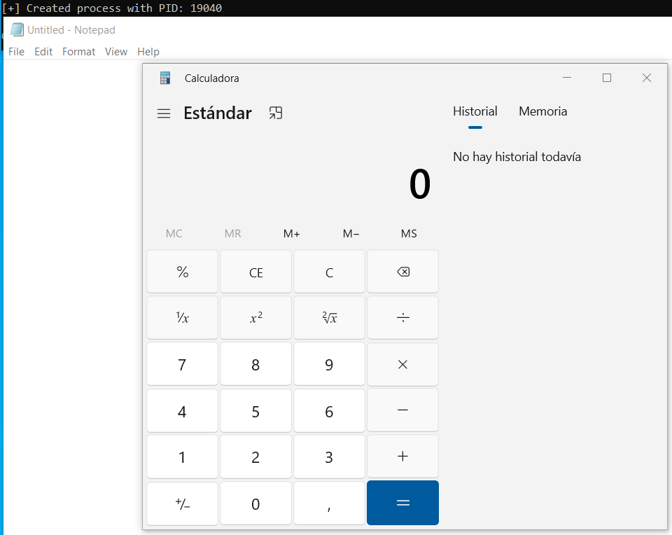

# non_ms_binaries

Code snippet to create a process using the "PROCESS_CREATION_MITIGATION_POLICY_BLOCK_NON_MICROSOFT_BINARIES_ALWAYS_ON" flag, which blocks 3rd party DLLs to be injected in it (such as EDR DLLs), allowing only Microsoft DLLs to be injected. 

Then it injects shellcode in the spawned process using (*VirtualAllocEx* + *WriteProcessMemory* + *VirtualProtectEx* + *CreateRemoteThread* + *QueueUserAPC*):

- calc: It creates Notepad process and the hardcoded payload spawns the calculator.

- dropper: It creates Notepad process and downloads the payload from a remote server.

### Sources:

- [https://github.com/leoloobeek/csharp/](https://github.com/leoloobeek/csharp/)

- Rastamouse's RTO2 course
